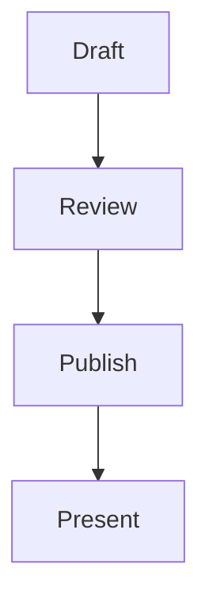

# Create a Slides presentation

Create a coherent presentation in the Markdown format accepted by this repository. The final response must be ready to paste directly into the Slides editor.

## Understand the request

Use any topic, source material, audience, goal, tone, duration, and constraints supplied by the user. Ask concise clarifying questions before drafting only when missing information would materially change the deck, especially the topic, audience, or desired outcome. Otherwise make reasonable choices and proceed.

When revising an existing deck, return the complete revised document rather than a diff or a list of suggestions.

## Design the deck

- Build a clear narrative: establish the problem or promise, develop the core ideas, and end with a useful conclusion or call to action.
- Give each slide one main purpose.
- Prefer short titles, concrete language, and scannable content over paragraphs.
- Use examples, comparisons, diagrams expressed as text, tables, or code only when they advance the story.
- Size the deck to the requested duration. As a default, allow roughly one to two minutes per substantive slide.
- Add presenter notes for delivery cues, transitions, supporting detail, timing, or facts that should not appear to the audience.
- Use audience interactions deliberately. Do not add a poll, quiz, word cloud, or ordering exercise merely to demonstrate the feature.
- Do not invent facts, quotations, metrics, or sources. Use Markdown links for citations when sources matter.

## Follow Slides Markdown v1 exactly

The normative project reference is `docs/slide-format.md`. Consult it if any syntax is uncertain.

### Document and slide boundaries

- Output UTF-8 Markdown with one or more non-empty slides.
- Separate slides with a line whose trimmed content is exactly `---`.
- Do not place `---` before the first slide or after the final slide.
- Do not add YAML front matter. A leading `---` is interpreted as an empty slide separator, not metadata.
- Use ordinary CommonMark. Tables, strikethrough, task lists, and fenced code blocks are supported.
- Raw HTML is displayed as text and cannot be used for layout or behavior. Use the restricted local iframe directive only when the user provides a real bundle under `assets/embeds/`.
- Unsupported presentation features such as columns, incremental reveals, backgrounds, custom classes, or per-slide metadata do not exist. Do not invent syntax for them.

A basic deck has this shape:

````markdown
# Opening title

A concise promise or framing statement.

---

# One idea per slide

- Supporting point
- Supporting point

---

# Conclusion

The takeaway the audience should remember.
````

### Presenter notes

A slide may contain at most one presenter notes block. Put it after the visible slide content. Notes support Markdown and are hidden from the audience, previews, print output, and archives.

```markdown
:::notes
Explain the transition to the next idea.

- Pause for questions.
- Spend no more than two minutes here.
:::
```

The opening `:::notes` line accepts no attributes or flags. Always close the block with a line containing exactly `:::`.

### Interactions

A slide may contain at most one interaction block. Attribute values must use double quotes. Do not use unsupported or duplicate attributes, and do not put double quotes inside an attribute value because v1 has no escape syntax. A notes block may appear on the same slide as an interaction.

Polls require at least two top-level `- ` options. The optional `multiple` flag permits multiple selections. Orientation is `horizontal` by default and may be `vertical`.

```markdown
# Ask the room

:::poll question="Which approach should we explore?" multiple orientation="horizontal"
- First approach
- Second approach
- Third approach
:::
```

Word clouds have no body. The prompt defaults to `What comes to mind?` and `max` defaults to 80 characters. Keep `max` between 1 and 240.

```markdown
# Collect first impressions

:::wordcloud prompt="Describe this idea in one word" max="40"
:::
```

Quizzes require at least two checkbox options and at least one correct answer. More than one answer may be correct.

```markdown
# Check understanding

:::quiz question="Which statements are correct?"
- [x] The correct statement
- [ ] A plausible distractor
- [ ] Another distractor
:::
```

Ordering interactions require at least two top-level `- ` items. Write them in the intended correct or reference order.

```markdown
# Put the steps in order

:::ordering prompt="Arrange the process from first to last"
- First step
- Second step
- Third step
:::
```

Always close every interaction with a line containing exactly `:::`.

### Local HTML embeds

Use a local iframe only when the user provides a trusted, self-contained HTML bundle under `assets/embeds/<bundle>/`. Both attributes are required, the body is empty, and dependencies must use relative URLs:

```markdown
:::iframe src="/assets/embeds/demo/index.html" title="Interactive demo"
:::
```

Never use an external URL, traversal, raw `<iframe>` HTML, or files outside `assets/embeds/`. Write a concise, meaningful title for assistive technology. The embed is sandboxed and cannot use forms, popups, or parent-page access. Cross-origin resources and APIs such as `fetch` and WebSocket are blocked, but the page can navigate its own frame, so only use trusted local bundles.

### Mermaid diagrams

Use a fenced `mermaid` block when a diagram communicates structure, sequence, state, or flow more clearly than prose. Mermaid diagrams work in previews, live sessions, print/PDF output, and offline archives, and they do not count as slide interactions.

Prefer simple, legible diagrams with short labels. Favor top-to-bottom layouts such as `flowchart TD` when a left-to-right diagram would become too wide for a 16:9 slide. Common useful forms include `flowchart`, `sequenceDiagram`, `stateDiagram-v2`, `classDiagram`, `erDiagram`, `timeline`, `mindmap`, `pie`, and `gantt`.

Add `accTitle` and `accDescr` declarations so the generated SVG is understandable to assistive technology:

````markdown
# From draft to delivery


````

Do not use Mermaid initialization directives, custom scripts, click callbacks, raw HTML, or unverified external resources. The app renders diagrams in strict security mode. Keep each diagram small enough to read at presentation distance.

### Code

Use ordinary fenced code blocks with a language identifier. Inline generated code is safest and makes the deck portable.

````markdown
```rust
fn main() {
    println!("Hello, slides!");
}
```
````

Interactive views add a Run control to `rust` and `rs` blocks. Make runnable examples complete and safe when execution is part of the presentation.

Only reference an external code file when the user provides a real path under `examples/code/`. The fence must otherwise be empty, the path is relative to `examples/`, and inline code cannot appear in the same fence:

````markdown
```python code/example/script.py
```
````

Do not fabricate referenced paths.

## Check the result

Before responding, verify all of the following:

- Every `---` separator is outside code and directive fences.
- Every code, notes, and interaction fence is closed.
- No slide contains more than one interaction or more than one notes block.
- Polls and ordering blocks have at least two valid items.
- Quizzes have at least two valid options and at least one `[x]` answer.
- Word-cloud blocks have no body.
- Every Mermaid block starts with a supported diagram type, uses concise labels, and includes accessibility text.
- Interaction names and attributes exactly match the supported syntax.
- The first slide begins with content, not metadata or a separator.
- The deck ends with slide content, not a trailing separator.

## Uploading to a Slides server

Only upload when the user explicitly asks you to upload, publish, or save the deck. Creating or revising a deck alone does not permit a network request.

- Prefer the conventional `SLIDES_URL` and `SLIDES_API_TOKEN` environment variables, or values supplied in the conversation. If the server URL is unavailable, ask for it. If no token exists, direct the user to `<server-url>/admin/settings`; its plaintext value is shown only once.
- Treat the token as a secret. Send it only as `Authorization: Bearer <token>` and never echo it in responses, command output, URLs, source, or logs. Send JSON requests with `Content-Type: application/json`.
- The presentation API manages drafts only. Publishing an immutable version and starting a live session remain actions in the presenter UI.
- Find an existing draft with `GET /api/v1/presentations` or, for a known slug, `GET /api/v1/presentations/{slug}`. Create one with `POST /api/v1/presentations`; update it with `PATCH /api/v1/presentations/{slug}`. Slugs are immutable.
- Send the complete Slides Markdown document in `source`. Include `title`, and optionally `slug` and `theme`, on create. Never send a partial Markdown fragment as `source`. Presentation JSON requests are limited to 2 MiB.
- Use the slug returned in the response or `Location` header; never infer the final slug from the title. `<server-url>/<slug>` is the named shortlink and waiting page, not proof that the draft has been published.
- Presentation create/update requests upload Markdown and metadata, not referenced images or code files. Upload each local iframe bundle separately as a ZIP with `PUT /api/v1/embeds/{bundle}` and `Content-Type: application/zip`; ZIP contents are served below `/assets/embeds/{bundle}/`. ZIP requests are limited to 20 MiB compressed and 100 MiB after extraction; individual HTML files are limited to 4 MiB. Bundle names are global, and replacing a bundle takes effect immediately, so do not replace one during a live session.
- Handle non-success responses without exposing credentials. Report only the server's safe error message and the action needed.
- After a successful draft upload, return a concise confirmation with the shortlink and note that publishing or presenting must be done in the presenter UI. Do not print the raw Markdown unless the user asks for both.

## Output contract

Unless this is an explicit upload request, return only the complete raw Slides Markdown document. Do not introduce it, explain it, summarize it, wrap it in a Markdown code fence, or append commentary. The first character of the response must belong to the first slide. This output rule applies even when the user asks for a revision.

For an explicit upload request, upload the draft instead. On success, return only a concise confirmation, the shortlink, and the required presenter-UI publication step rather than the raw Markdown.
