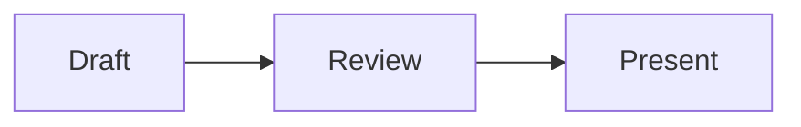

# Slides

A server-rendered interactive presentation app built with Rust, Axum, SQLite, and HTMX 4.

The current vertical slice supports:

- Markdown decks separated by `---`, with presenter-only notes
- Highlighted fenced code blocks, with sandboxed Rust execution through `play.rust-lang.org`
- Unsaved preview, saved drafts, and immutable published versions
- Named shortlinks, automatically derived from deck titles when omitted, and six-digit live-session codes
- Presenter-controlled slide navigation, keyboard shortcuts, audience locking, and attention recall
- Anonymous polls, word clouds, quizzes, card ordering, raised hands, audience questions with upvotes, and rate-limited reactions
- Live horizontal and vertical result charts over Server-Sent Events
- Responsive presenter and audience views
- Independent headline, text, and code fonts plus configurable color themes
- A bearer-authenticated JSON API for creating, reading, updating, and deleting presentations

## Run it

```sh
SLIDES_ADMIN_PASSWORD=change-me cargo run
```

Open <http://127.0.0.1:3000>. The SQLite database is created as `slides.db` by default.

Validate a presentation without starting the server:

```sh
cargo run -- validate examples/intro-to-rust.md
```

The command checks the Markdown and interaction syntax, semantic interaction rules, and referenced code files. It exits unsuccessfully with a slide-specific error when validation fails.

Configuration:

- `SLIDES_ADMIN_PASSWORD`: required presenter password
- `SLIDES_DATABASE_URL`: defaults to `sqlite://slides.db`
- `SLIDES_BIND`: defaults to `127.0.0.1:3000`
- `SLIDES_SECURE_COOKIES`: set to `true` behind HTTPS
- `RUST_LOG`: standard tracing filter
- `SLIDES_HEALTHCHECK_URL`: Docker health-check URL; override it when changing the container's `SLIDES_BIND` port

`GET /healthz` returns `200 OK` when the process can query SQLite and `503 Service Unavailable` otherwise.

## Presentation API

Sign in as the presenter and open `/admin/settings` to generate the workspace API token and view request examples. The plaintext token is shown only when generated; Slides stores only its SHA-256 hash. Regenerating or revoking it invalidates the previous token immediately.

All API requests use `Authorization: Bearer <token>`. The versioned endpoints are:

- `GET /api/v1/presentations`
- `POST /api/v1/presentations`
- `GET /api/v1/presentations/{slug}`
- `PATCH /api/v1/presentations/{slug}`
- `DELETE /api/v1/presentations/{slug}`

Create and source-update requests validate the Slides Markdown before saving it. Theme objects can set `headline_font`, `text_font`, and `code_font` independently; the legacy `font` field remains accepted for compatibility. Request bodies are limited to 2 MiB, and API errors use a JSON `error.code` plus `error.message` shape. Full examples and the request schema are available on the settings page.

Presenter shortcuts use `ArrowLeft` or `PageUp` for the previous slide, `ArrowRight`, `PageDown`, or `Space` for the next slide, and `Home` to call everyone back to the current slide. Audience shortcuts use `Alt+H` to raise or lower a hand and `Alt+1`, `Alt+2`, or `Alt+3` for applause, lightbulb, or question reactions.

## Docker

Build and run the production image with a persistent data directory:

```sh
docker build -t slides .
docker volume create slides-data
docker run --rm \
  --name slides \
  -p 3000:3000 \
  -e SLIDES_ADMIN_PASSWORD=change-me \
  -e SLIDES_SECURE_COOKIES=false \
  -v slides-data:/app/data \
  slides
```

In production, provide `SLIDES_ADMIN_PASSWORD` through the deployment platform's secret store and set `SLIDES_SECURE_COOKIES=true` behind HTTPS. The container runs as UID/GID `10001`; `/app/data` must be writable by that user on Linux hosts.

The current live-update hub is process-local. Run exactly one application replica and mount persistent SQLite storage at `/app/data`.

## CI and deployment

`.github/workflows/ci.yml` formats, lints, and tests Rust; builds the Docker image for pull requests; and publishes `latest` plus commit-SHA tags to GHCR from `main`.

A push to `main` deploys the published `ghcr.io/corrode/slides:latest` image to an existing Coolify Docker-image application. The application exposes port `3000`, mounts the `slides-data` volume at `/app/data`, uses `/healthz` for health checks, and runs one replica. The workflow requires:

- secret `COOLIFY_TOKEN`: a Coolify API token with write and deploy access;
- secret `ADMIN_TOKEN`: the production presenter password;
- variable `COOLIFY_RESOURCE_UUID`: the Docker-image application's UUID;
- optional variable `COOLIFY_BASE_URL`: defaults to `https://admin.corrode.dev`;
- optional variable `DEPLOY_HEALTHCHECK_URL`: defaults to `https://slides.corrode.dev/healthz`.

Every deployment creates the Intro to Rust deck when needed and republishes it from `examples/intro-to-rust.md`.

## Database migrations

SQLx verifies applied migrations by checksum. Once a migration has been run anywhere, do not edit or reformat it; add a new numbered file under `migrations/` instead. `.gitattributes` keeps migration line endings stable across platforms.

## Authoring syntax

The normative format specification and research notes are in [`docs/slide-format.md`](docs/slide-format.md). A complete, ready-to-present showcase is available at [`examples/kitchen-sink.md`](examples/kitchen-sink.md).

Decks use `---` separators, CommonMark content, fenced code blocks, Mermaid diagrams, optional `:::notes` presenter notes, and at most one poll, quiz, word cloud, or ordering interaction per slide. Reactions and raised hands are available without authoring syntax.

Code shipped beside presentations under `examples/code/` can be included with an empty fence:

````markdown
```python code/path/to/example.py
```
````

Drafts read the file directly; publishing snapshots its contents into the immutable deck version.

Fenced `mermaid` blocks render diagrams in previews, live sessions, print/PDF output, and offline archives:

````markdown

````

Running a Rust code block sends that block's source through the Slides server to the public Rust Playground. The Slides container therefore needs outbound HTTPS access to `play.rust-lang.org`; the code runs in the Playground sandbox, not on the Slides host.

HTMX 4.0.0, its `hx-sse` extension, and Mermaid 11.17.2 are vendored under `assets/`; the app has no frontend build step. The files come from their official jsDelivr packages. The SHA-256 checksums for `htmx.min.js`, `hx-sse.min.js`, and `vendor/mermaid/mermaid.min.js` are `e484d9171a9db30a39c8f16e3d709d4137f3211c659f8e6125816635033d593f`, `8a834680c4000a9034d79228872372a92e140c810a075cb6d4a76690dfc13085`, and `581ed7d74bd9048d0e3a91363927d72ef22942d7722546b27f7cc29e35390eb8`, respectively.

Live updates use an in-process broadcast hub, so the current version must run as a single application process. SQLite remains the durable source of truth.
