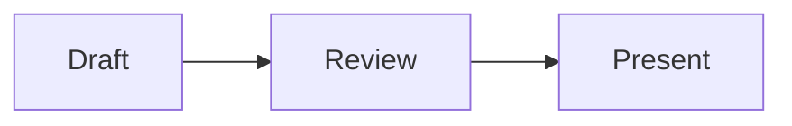

# Slides

A server-rendered interactive presentation app built with Rust, Axum, SQLite, and HTMX 4.

The current vertical slice supports:

- Markdown decks separated by `---`, with presenter-only notes
- Highlighted fenced code blocks, with sandboxed Rust execution through `play.rust-lang.org`
- ZIP bundle drafts with read-only browser preview, publish, present, and print actions, plus immutable published versions
- Named shortlinks, six-digit session codes, and one live presentation per Slides instance
- Presenter-controlled slide navigation, keyboard shortcuts, audience locking, and attention recall
- Anonymous polls, word clouds, quizzes, card ordering, raised hands, audience questions with upvotes, and rate-limited reactions
- Live horizontal and vertical result charts over Server-Sent Events
- Responsive presenter and audience views
- Independent headline, text, and code fonts plus color themes, configurable in the browser for legacy decks only; new bundles use defaults, and bundle replacements preserve the deck's existing theme
- A bearer-authenticated API for uploading complete presentation ZIP bundles, reading presentations, and deleting them

## Run it

```sh
ADMIN_PASSWORD=change-me cargo run
```

Open <http://127.0.0.1:3000>. The SQLite database is created as `slides.db` by default.

Validate a presentation without starting the server:

```sh
cargo run -- validate examples/intro-to-rust.md
```

The command checks the Markdown and interaction syntax, semantic interaction rules, and referenced code files. It exits unsuccessfully with a slide-specific error when validation fails.

Configuration:

- `ADMIN_PASSWORD`: required presenter password
- `SLIDES_DATABASE_URL`: defaults to `sqlite://slides.db`
- `SLIDES_BIND`: defaults to `127.0.0.1:3000`
- `SLIDES_EMBED_DIR`: persistent immutable presentation bundle generations and legacy iframe assets; defaults to `data/embeds`
- `SLIDES_SECURE_COOKIES`: set to `true` behind HTTPS
- `RUST_LOG`: standard tracing filter
- `SLIDES_HEALTHCHECK_URL`: Docker health-check URL; override it when changing the container's `SLIDES_BIND` port

`GET /healthz` returns `200 OK` when the process can query SQLite and `503 Service Unavailable` otherwise.

## Presentation API

Sign in as the presenter and open `/admin/settings` to generate the workspace API token and view request examples. The plaintext token is shown only when generated; Slides stores only its SHA-256 hash. Regenerating or revoking it invalidates the previous token immediately.

All API requests use `Authorization: Bearer <token>`. The versioned endpoints are:

- `GET /api/v1/presentations`
- `GET /api/v1/presentations/{slug}`
- `POST /api/v1/presentations/{slug}/bundle`
- `DELETE /api/v1/presentations/{slug}`

Upload a complete ZIP as the raw request body with `Content-Type: application/zip` (not JSON or multipart). Choose the slug in the URL. A new presentation returns `201 Created`; replacing an existing draft returns `200 OK`. The JSON response contains `slug`, `title`, `files`, and `bytes`, with a `Location` header pointing to the presentation API resource. API errors use `error.code` and `error.message`.

The ZIP must contain UTF-8 `slides.md` at its root, not inside a wrapper directory. Its first H1 supplies the title; keep it nonempty and at most 120 characters. There is no manifest or metadata request body. Include all referenced code, images, HTML, scripts, styles, and fonts in the same ZIP. Limits: 20 MiB ZIP, 100 MiB extracted, 512 entries (including directories), 2 MiB for `slides.md`, and 4 MiB per HTML file. See the [bundle format](docs/slide-format.md#presentation-bundles) for supported paths and file types.

For a minimal upload, run this from a directory containing `slides.md`. Python's standard library creates a ZIP with no wrapper parent:

```sh
python3 -m zipfile -c presentation.zip slides.md
curl --fail-with-body --request POST \
  "$SLIDES_URL/api/v1/presentations/my-talk/bundle" \
  --header "Authorization: Bearer $SLIDES_API_TOKEN" \
  --header "Content-Type: application/zip" \
  --data-binary @presentation.zip
```

For a deck with sibling `code/`, `images/`, and `demo/` directories, include them with `python3 -m zipfile -c presentation.zip slides.md code images demo`. Alternatively, from that same directory, use `zip -r presentation.zip slides.md code images demo` with a fresh output ZIP. Include only directories that exist; do not ZIP their parent folder.

Each successful upload installs a new immutable asset generation and replaces only the draft. Published versions and their assets never change when a draft is replaced, including during a live session. In the browser, bundle decks are read-only: preview, publish, present, and print are available; changes require another complete ZIP upload. Existing legacy decks retain browser editing as a migration bridge. Publishing and starting live sessions remain presenter UI actions, not bundle upload side effects.

Presenter shortcuts use `ArrowLeft` or `PageUp` for the previous slide, `ArrowRight`, `PageDown`, or `Space` for the next slide, and `Home` to call everyone back to the current slide. Audience shortcuts use `Alt+H` to raise or lower a hand and `Alt+1`, `Alt+2`, or `Alt+3` for applause, lightbulb, or question reactions.

Bundle generations are retained on disk, including superseded drafts; v1 does not garbage-collect them. Deleting a presentation revokes access to its generations but does not reclaim their directories. Back up the database and `SLIDES_EMBED_DIR` together, and account for retained generations when monitoring disk usage.

## Docker

Build and run the production image with a persistent data directory:

```sh
docker build -t slides .
docker volume create slides-data
docker run --rm \
  --name slides \
  -p 3000:3000 \
  -e ADMIN_PASSWORD=change-me \
  -e SLIDES_SECURE_COOKIES=false \
  -v slides-data:/app/data \
  slides
```

In production, provide `ADMIN_PASSWORD` through the deployment platform's secret store and set `SLIDES_SECURE_COOKIES=true` behind HTTPS. The container runs as UID/GID `10001`; `/app/data` must be writable by that user on Linux hosts.

The current live-update hub is process-local. Run exactly one application replica and mount persistent SQLite storage at `/app/data`.

## CI and deployment

`.github/workflows/ci.yml` formats, lints, and tests Rust; builds the Docker image for pull requests; and publishes `latest` plus commit-SHA tags to GHCR from `main`.

A push to `main` deploys the published `ghcr.io/corrode/slides:latest` image to an existing Coolify Docker-image application. The application exposes port `3000`, mounts the `slides-data` volume at `/app/data`, uses `/healthz` for health checks, and runs one replica. The workflow requires:

- secret `COOLIFY_TOKEN`: a Coolify API token with write and deploy access;

- variable `COOLIFY_RESOURCE_UUID`: the Docker-image application's UUID;
- optional variable `COOLIFY_BASE_URL`: defaults to `https://admin.corrode.dev`;
- optional variable `DEPLOY_HEALTHCHECK_URL`: defaults to `https://slides.corrode.dev/healthz`.

Set `ADMIN_PASSWORD` directly in the Coolify application's environment before deploying. CI does not configure the admin password, log into Slides, upload bundles, or publish presentations. Neither the admin password nor a Slides API token is required as a GitHub Actions secret. Upload and publish presentations separately from application deployment.

## Database migrations

SQLx verifies applied migrations by checksum. Once a migration has been run anywhere, do not edit or reformat it; add a new numbered file under `migrations/` instead. `.gitattributes` keeps migration line endings stable across platforms.

## Authoring syntax

The normative format specification and research notes are in [`docs/slide-format.md`](docs/slide-format.md). A complete, ready-to-present showcase is available at [`examples/kitchen-sink.md`](examples/kitchen-sink.md).

Decks use `---` separators, CommonMark content, fenced code blocks, Mermaid diagrams, optional `:::notes` presenter notes, local `:::iframe` embeds, and at most one poll, quiz, word cloud, or ordering interaction per slide. Reactions and raised hands are available without authoring syntax.

Code shipped in the bundle's `code/` directory can be included in full with an otherwise empty fence:

````markdown
```python code/path/to/example.py
```
````

Bundle uploads resolve the whole UTF-8 file into the draft; line ranges and snippets are not supported. Existing legacy decks still resolve paths under `examples/code/`, with contents snapshotted on publication.

Fenced `mermaid` blocks render diagrams in previews, live sessions, print/PDF output, and offline archives:

````markdown

````

Local HTML pages can be embedded using a path relative to the ZIP root:

```markdown
:::iframe src="demo/index.html" title="Interactive demo"
:::
```

Use relative paths for Markdown images and local links too, such as `` and `[Source](code/example.rs)`. The server rewrites these to immutable generation URLs. HTML may run JavaScript in a sandbox, but all resource dependencies must be bundled and use relative URLs; external resources and network APIs are blocked. Ordinary external navigation links in Markdown remain supported. See the format specification for security restrictions and legacy embed compatibility.

Running a Rust code block sends that block's source through the Slides server to the public Rust Playground. The Slides container therefore needs outbound HTTPS access to `play.rust-lang.org`; the code runs in the Playground sandbox, not on the Slides host.

HTMX 4.0.0, its `hx-sse` extension, and Mermaid 11.17.2 are vendored under `assets/`; the app has no frontend build step. The files come from their official jsDelivr packages. The SHA-256 checksums for `htmx.min.js`, `hx-sse.min.js`, and `vendor/mermaid/mermaid.min.js` are `e484d9171a9db30a39c8f16e3d709d4137f3211c659f8e6125816635033d593f`, `8a834680c4000a9034d79228872372a92e140c810a075cb6d4a76690dfc13085`, and `581ed7d74bd9048d0e3a91363927d72ef22942d7722546b27f7cc29e35390eb8`, respectively.

Live updates use an in-process broadcast hub, so the current version must run as a single application process. SQLite remains the durable source of truth.
