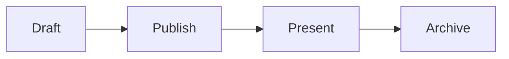

# Slides Markdown v1

Status: draft specification of the format implemented by this repository.

This document defines the portable authoring subset accepted by Slides. It distinguishes current behavior from possible future extensions so a deck does not accidentally depend on syntax the application cannot render.

## Design goals

Slides Markdown should be:

- readable as ordinary Markdown;
- predictable enough to validate before presenting;
- explicit about presentation-only behavior;
- safe to render from untrusted audience-facing content;
- independent of a frontend framework;
- evolvable without silently changing an existing deck.

The format intentionally does not derive navigation from heading levels, execute raw HTML from Markdown, or use list markers and image alt text as hidden presentation commands. Trusted local HTML bundles are available only through the restricted iframe directive described below.

## Presentation bundles

Create or replace a draft with `POST /api/v1/presentations/{slug}/bundle`, `Authorization: Bearer <token>`, and a raw `application/zip` body. Creation returns `201 Created`; replacement returns `200 OK`. No JSON or multipart wrapper is accepted. The slug comes from the URL, not the title. There is no manifest or separate metadata file.

The archive must contain the exact root filename `slides.md`, encoded as UTF-8. The first H1's text (including inline code text, with formatting removed) supplies the title. It must be nonempty; keep it at most 120 characters. Do not wrap the files in a parent directory:

```text
slides.md
code/example.rs
images/diagram.svg
demo/index.html
demo/app.js
demo/style.css
```

From the directory containing these files, create a fresh archive with `python3 -m zipfile -c presentation.zip slides.md code images demo` (standard-library Python), or `zip -r presentation.zip slides.md code images demo` if `zip` is installed. Omit directories that do not exist. For a Markdown-only deck, include just `slides.md`. See the [README upload example](../README.md#presentation-api) for curl authentication and upload.

### Archive validation

- Maximum ZIP body: **20 MiB**; maximum actual extracted bytes: **100 MiB**.
- Maximum **512 entries**, including directory entries; `slides.md` is limited to **2 MiB**, each `.html` or `.htm` file to **4 MiB**. Resolved Markdown is limited to **100 MiB**.
- Only Stored and Deflated ZIP entries are supported. Encrypted archives, symlinks, special files, duplicate paths (ASCII case-insensitive), file/directory collisions, and corrupt entries are rejected.
- Path segments use only ASCII letters, digits, `.`, `-`, and `_`. Empty segments, `.` or `..` segments, trailing dots, absolute paths, backslashes, spaces, percent-encoded paths, and non-ASCII names are rejected.
- Allowed file extensions (case-insensitive): `rs`, `c`, `h`, `cpp`, `hpp`, `py`, `go`, `java`, `ts`, `tsx`, `jsx`, `sh`, `toml`, `json`, `yaml`, `yml`, `txt`, `css`, `js`, `mjs`, `png`, `jpg`, `jpeg`, `gif`, `webp`, `svg`, `ico`, `avif`, `woff`, `woff2`, `ttf`, `otf`, `md`, `html`, `htm`.

Upload validation resolves code includes and local Markdown/iframe references, then validates Slides Markdown. Original files remain in a new immutable generation; the draft stores resolved Markdown. Replacing a draft never changes published versions or their assets. Bundle decks are read-only in the browser, with preview, publish, present, and print actions. Upload a complete replacement ZIP to revise them. Existing legacy decks retain browser editing as a migration bridge; their path behavior is called out below.

## Document model

A deck is UTF-8 Markdown containing one or more slides. Each slide contains:

1. Markdown content;
2. zero or more local iframe blocks;
3. at most one interaction block; and
4. at most one presenter notes block.

Reactions are a session feature and require no authoring syntax.

### Slide boundaries

A line whose trimmed content is exactly `---` starts a new slide:

```markdown
# First slide

---

# Second slide
```

Leading and trailing whitespace on the separator line is allowed. Empty sections are ignored. Separators inside fenced code blocks are treated as code, not as slide boundaries:

````markdown
```text
---
```
````

Slides Markdown v1 has no YAML front matter. A leading `---` is therefore a slide separator, not a metadata delimiter.

### Markdown profile

The content parser supports CommonMark plus:

- tables;
- strikethrough;
- task lists;
- fenced and indented code blocks.

The first token after a fenced-code marker is used as the syntax name. Unknown syntax names fall back to plain text. Fenced `mermaid` blocks render as diagrams as described below. On interactive pages, fenced `rust` and `rs` blocks get a **Run** control. The server forwards that block's source to the stable Rust 2024 toolchain at `play.rust-lang.org`; code runs in the official Playground sandbox, never in the Slides process. Print/PDF output and offline session archives contain highlighted code without the **Run** control.

### Referenced code files

Executable examples live under `code/` in the ZIP and are referenced as the second token of an otherwise empty code fence:

````markdown
```python code/word-count/python/step_01.py
```
````

The first token selects syntax highlighting. The second is a path relative to the ZIP root and must start with `code/`. Uploading includes the **whole UTF-8 file** as ordinary inline code; there are no line ranges or snippet selectors. The only supported extra argument is one trailing `ide="URL"` attribute, preserved when the include expands. Missing files, unsafe paths, non-UTF-8 content, and fences that also contain inline code are rejected. If the referenced file contains a line that would close the fence, use a longer fence or the other fence marker.

For existing legacy decks and repository CLI validation only, paths resolve relative to `examples/`, under `examples/code/`. Legacy draft previews read the current file; publication snapshots its contents. Bundle previews instead use the code resolved at upload time.

### Code fence IDE links

Inline code and otherwise empty include fences accept `language [code/path] [ide="URL"]`:

````markdown
```rust ide="zed://file/..."
fn main() {}
```

```rust code/example.rs ide="zed://file/..."
```
````

The abbreviated URLs above illustrate syntax only. Use user-supplied editor URLs and paths in actual decks, not invented local destinations. IDE metadata survives code-include expansion and does not become part of the displayed or copied code.

- Use exactly one lowercase `ide` attribute after the language and optional include path. Double quotes are required; percent-encode spaces as `%20`. Raw whitespace, control characters, quotes, backslashes, backticks, and angle brackets are rejected. Duplicate or malformed attributes and additional arguments alongside IDE metadata are rejected.
- Allowed URL schemes are `zed`, `vscode`, `vscode-insiders`, `idea`, `pycharm`, `clion`, `goland`, `rustrover`, `webstorm`, `phpstorm`, `rider`, `rubymine`, `datagrip`, and `jetbrains` (case-insensitive). A nonempty destination after `:` is required. Other schemes, including `javascript:`, `data:`, `file:`, and HTTP(S), are rejected here.
- On interactive pages, an **Open in IDE** link icon appears beside **Copy** on code hover or keyboard focus and stays visible on touch devices. It is a native link with an accessible label. **Run** remains exclusive to `rust` and `rs` blocks; other code languages can have IDE links without execution controls.
- Opening requires an explicit user action and an installed URL handler on the viewer's machine; the browser may ask permission. Slides never launches the IDE automatically, fetches its URL, or checks whether its target file exists. The separate `code/` include still must exist.
- `mermaid` fences do not support `ide`. This editor-scheme allowlist applies only to code fence metadata, not ordinary Markdown links, which still allow only HTTP(S), `mailto:`, and `zed:` schemes (plus local references and fragments).

### Mermaid diagrams

A fenced code block whose language is `mermaid` renders as a diagram:

````markdown

````

Slides uses the vendored Mermaid 11.17.2 browser renderer in strict security mode. Diagrams work in editor previews, presenter and audience views, print/PDF output, and downloadable session archives. The original escaped source remains visible if JavaScript is unavailable or Mermaid rejects the diagram.

Mermaid blocks may coexist with an interaction, iframe, or notes block and do not count toward the one-interaction-per-slide limit. Keep diagrams compact enough for a 16:9 slide. Add Mermaid's `accTitle` and `accDescr` declarations so the generated SVG has an accessible name and description. Custom scripts and raw HTML are not supported.

### Local HTML embeds

Trusted HTML pages included in the presentation ZIP can be placed on a slide with an iframe block. Use a path relative to the ZIP root:

```markdown
:::iframe src="demo/index.html" title="Interactive ownership demo"
:::
```

Both attributes are required. `src` must reference an existing `.html` or `.htm` file in the ZIP. The block body must be empty. `title` must be meaningful for assistive technology and may contain at most 200 characters. The server rewrites the relative path to `/assets/embeds/<generation>/demo/index.html`; do not author that generated URL yourself.

Existing legacy decks still use `/assets/embeds/<bundle>/index.html` references to server-local assets. Those absolute paths are not accepted as references in a new presentation ZIP.

Slides renders the page in a sandbox that allows scripts but does not grant same-origin access, forms, popups, downloads, top-level navigation, workers, or nested frames. Its content policy blocks cross-origin subresources and APIs such as `fetch`, WebSocket, and EventSource. An embed can still navigate its own frame to another page, so iframe bundles must be trusted local content. Embed HTML is also served with a response-level sandbox, including when opened directly, and archived copies receive an equivalent embedded content policy. Keep scripts, styles, images, fonts, and other dependencies in the same bundle and use relative URLs.

Downloaded session archives include the complete bundle, up to 512 files and 100 MiB across all iframe bundles. Relative dependencies continue to work without rewriting. Module scripts may still require serving an extracted archive over HTTP rather than opening it with `file://`.

Iframe blocks may appear alongside Markdown, interactions, Mermaid diagrams, and presenter notes.

### Images and links

Raw HTML in Markdown is escaped and displayed as text, never executed. In a presentation ZIP, images and local links must reference existing files relative to the ZIP root:

```markdown

[Example source](code/example.rs)
[Reference](https://www.rust-lang.org/)
```

Inline and reference-style Markdown images and links are resolved at upload time. One leading `./` is allowed. Local paths use the archive's safe filename rules; absolute paths and traversal are rejected. Query strings and fragments on local references are preserved, but cannot contain control characters, backslashes, `%`, `:`, quotes, angle brackets, or spaces. Iframe URLs must also satisfy the iframe parser's stricter rules; prefer a plain relative filename.

Images and iframe sources cannot use remote URLs. Ordinary navigation links may still use `http://`, `https://`, `mailto:`, `zed:`, or a fragment identifier; these are not bundled resources. Schemes are case-insensitive. Zed links, for example `[Open in Zed](zed://file/Users/example/project/main.rs:12:3)`, remain clickable in slide content and presenter notes; their targets are not fetched or checked for existence. Opening them requires Zed's URL handler on the viewer's machine and may prompt for permission. `zed:` is allowed only for navigation, never as an image or iframe source. HTML may run sandboxed JavaScript, but scripts, styles, images, fonts, and other resources must be bundled, not loaded from CDNs or external services. HTML dependency URLs are left unchanged, not fetched or rewritten by the importer.

For existing legacy decks, the Markdown renderer also accepts `/`-absolute paths and remote image URLs; unsupported schemes are replaced with `#`. This renderer behavior does not bypass bundle upload validation.

### Presenter notes

Presenter-only notes use a fenced `:::notes` block. The body supports the same sanitized Markdown as slide content:

```markdown
:::notes
Explain why the borrow ends before the next statement.

- Pause for questions.
- Keep this example under two minutes.
:::
```

A slide may contain at most one notes block. The opening line accepts no attributes or flags. Notes markers inside code fences remain code. Presenter notes appear in a collapsible panel in the live presenter view and are excluded from the audience view, editor preview, print/PDF output, and final session archive.

## Interaction blocks

An interaction is a fenced container with an opening line, an optional body, and a closing line containing exactly `:::`:

```markdown
:::kind attribute="value" flag
body
:::
```

Interaction markers inside code fences are treated as code. Only one interaction block is allowed per slide.

Attribute values are enclosed in double quotes. Slides Markdown v1 does not define an escape syntax inside an attribute value. Flags are bare, whitespace-separated words. Unsupported, duplicate, or malformed attributes and flags are validation errors.

### Poll

```markdown
:::poll question="Which language do you use most?" multiple orientation="vertical"
- Rust
- Python
- TypeScript
:::
```

| Input | Required | Meaning |
| --- | --- | --- |
| `question="…"` | No | Optional prompt shown above the choices. Omitted or empty values render no prompt. |
| `multiple` | No | Allows more than one selected answer. |
| `orientation="horizontal"` | No | Displays horizontal result bars. This is the default. |
| `orientation="vertical"` | No | Displays vertical result bars. |
| `- option` body lines | Yes | Defines answer options. At least two non-empty options are required. |

Only top-level body lines beginning with `- ` define poll options. The orientation defaults to horizontal, so a slide heading followed by a minimal poll is valid:

```markdown
# Coffee or beer?

:::poll
- Coffee
- Beer
:::
```

### Word cloud

```markdown
:::wordcloud prompt="Describe Rust in one word" max="80"
:::
```

| Input | Required | Meaning |
| --- | --- | --- |
| `prompt="…"` | No | Prompt shown to the audience. Defaults to `What comes to mind?`. |
| `max="N"` | No | Maximum answer length. Defaults to 80 and is normalized to the range 1–240. |

A word-cloud block has no body in v1.

### Quiz

```markdown
:::quiz question="Which type owns its text?"
- [x] String
- [ ] &str
:::
```

| Input | Required | Meaning |
| --- | --- | --- |
| `question="…"` | No | Prompt shown to the audience. Defaults to `Choose the correct answer`. |
| `- [x] answer` | Yes | Defines a correct answer. Uppercase `[X]` is also accepted. |
| `- [ ] answer` | Yes | Defines an incorrect answer. |

A quiz requires at least two non-empty checkbox options and at least one correct option. More than one answer may be marked correct.

### Ordering

```markdown
:::ordering prompt="Put the release steps in order"
- Build
- Test
- Deploy
:::
```

| Input | Required | Meaning |
| --- | --- | --- |
| `prompt="…"` | No | Instruction shown above the cards. Defaults to `Put these items in order`. |
| `- item` body lines | Yes | Defines draggable cards in their initial order. At least two non-empty items are required. |

Each participant submits one complete ordering. Cards can be reordered with drag and drop or the accessible move buttons. Changes are saved immediately; participants can use **Save order** to submit the initial order unchanged. The current aggregate group order is visible to the presenter and audience in real time. Ties retain source order.

## Complete example

````markdown
# Ownership in Rust

```rust
fn consume(value: String) {
    println!("{value}");
}
```

---

# Ask the audience

:::poll question="Which language do you use most?" multiple orientation="horizontal"
- Rust
- Python
- TypeScript
- Go
:::

---

# One word

:::wordcloud prompt="Describe Rust in one word" max="80"
:::

---

# Quick quiz

:::quiz question="Which type owns its text?"
- [x] String
- [ ] &str
:::

---

# Rank the steps

:::ordering prompt="Put these steps in order"
- Draft
- Review
- Publish
:::
````

## Validation and compatibility

Malformed supported interaction blocks make the deck invalid. Validation errors identify the one-based slide number. Unknown Markdown remains ordinary content unless a future format revision assigns it presentation semantics.

Changes that alter the meaning of valid v1 source require a new format version. Additive parser changes must not reinterpret ordinary Markdown constructs such as headings, list marker choice, image alt text, or HTML comments.

## Researched future extensions

The following syntax is reserved for design work and is **not implemented in v1**:

- global deck metadata with an explicit format version;
- `:::steps` for incremental reveals;
- `:::columns` and `:::column` for constrained layouts;
- per-slide attributes for IDs, layouts, backgrounds, and classes;
- code-fence attributes for line numbers and progressive highlighting;
- explicit export policy for fragments and hidden slides.

Dedicated fenced blocks are preferred over HTML comments, altered list markers, framework directives, or image-alt mini-languages. Unknown presentation directives should become validation errors once a versioned directive namespace exists.

A likely future direction is:

````markdown
---
format: slides/2
title: Reliable presentations
export:
  fragments: final
  notes: none
---

{#pipeline layout="two-column"}

# Build pipeline

:::steps
- Parse Markdown
- Validate directives and assets
- Render deterministic output
:::

:::notes
Explain why deterministic export policy belongs in the document model.
:::
````

The metadata, slide attributes, and `:::steps` syntax in this example are illustrative and must not be used in a v1 deck. The `:::notes` block is valid v1 syntax.

## Research notes

The v1 shape and proposed evolution were compared with Marp, reveal.js/reveal-md, Slidev, Deckset, Pandoc, and remark.

### Conventions worth keeping

- `---` is the most widely understood explicit slide separator.
- Plain Markdown should remain the content language.
- Presentation semantics work best as explicit blocks or attributes.
- Named layouts are more portable than arbitrary absolute positioning.
- Notes, fragments, columns, and code-line emphasis are the most useful common extensions.
- Export needs a deterministic policy rather than relying on whatever a browser happens to print.

### Patterns intentionally avoided

- Heading depth controlling slide hierarchy, because nested headings and containers can unexpectedly change navigation.
- HTML comments serving as both notes and directives.
- `*` and `-` list markers producing different presentation behavior.
- Layout commands hidden in image alt text.
- Runtime Vue components, arbitrary JavaScript, or raw HTML in the portable core.
- Regex-configurable separators.
- Browser-only PDF behavior without a pinned export environment.

### Recurring complaints in existing tools

Export fidelity dominates issue trackers:

- Marp users request fragment-aware PDF/PPTX pages and editable PowerPoint output: [marp-cli #496](https://github.com/marp-team/marp-cli/issues/496), [#698](https://github.com/marp-team/marp-cli/issues/698), and [#673](https://github.com/marp-team/marp-cli/issues/673).
- reveal.js has had fragment/MathJax and speaker-note printing regressions: [reveal.js #2256](https://github.com/hakimel/reveal.js/issues/2256) and [#3535](https://github.com/hakimel/reveal.js/issues/3535).
- Slidev reports blank PDFs, Playwright-specific failures, and click-state mismatches: [Slidev #1240](https://github.com/slidevjs/slidev/issues/1240), [#2091](https://github.com/slidevjs/slidev/issues/2091), and [#2034](https://github.com/slidevjs/slidev/issues/2034).
- remark's long-running [PDF export issue #50](https://github.com/gnab/remark/issues/50) contains reports of page-size, blank-output, background, crash, and browser-version problems.

Syntax and layout are the next largest sources of friction:

- reveal.js Markdown attributes have interfered with code and list parsing: [reveal.js #3067](https://github.com/hakimel/reveal.js/issues/3067).
- General slide autoscaling and content overflow remain difficult in Marp: [marp-core #128](https://github.com/marp-team/marp-core/issues/128) and [#197](https://github.com/marp-team/marp-core/issues/197).
- Pandoc's heading-derived slide levels and fenced containers have produced surprising nested navigation: [Pandoc #5168](https://github.com/jgm/pandoc/issues/5168) and [#8098](https://github.com/jgm/pandoc/issues/8098).
- Local assets and offline builds need explicit handling: [marp-cli #393](https://github.com/marp-team/marp-cli/issues/393) and [Slidev discussion #2644](https://github.com/slidevjs/slidev/discussions/2644).

Maintenance and portability also matter. [reveal-md](https://github.com/webpro/reveal-md) states that it is no longer in active development, while Slidev's Vue/component syntax trades portability for power. The portable core should therefore stay smaller than either framework.

### Primary documentation

- [Marp: How to write slides](https://marp.app/docs/guide/how-to-write-slides)
- [reveal.js Markdown](https://revealjs.com/markdown/)
- [Slidev syntax guide](https://sli.dev/guide/syntax)
- [Deckset Markdown documentation](https://docs.deckset.com/markdownDocumentation.html)
- [Pandoc slide shows](https://pandoc.org/MANUAL.html#slide-shows)
- [remark Markdown](https://github.com/gnab/remark/wiki/Markdown)
